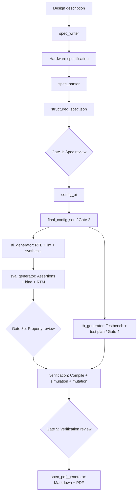

# VLSIT — AI-Assisted RTL Design & Verification Flow

**Quy trình thiết kế và kiểm chứng RTL với sự hỗ trợ của AI, dựa trên yêu cầu kỹ thuật và các bước review của kỹ sư.**

> **Trạng thái:** Engineering prototype · Claude Code workflow · SystemVerilog RTL & verification

## Overview

VLSIT tổ chức quy trình từ **hardware specification → requirements → configuration → RTL → assertions/testbench → verification → documentation**. Các prompt dạng slash command hướng dẫn Claude Code tạo artifact, gọi công cụ EDA và tổng hợp kết quả để kỹ sư review.

Trọng tâm của project là **requirements traceability**: liên kết yêu cầu với RTL, SystemVerilog Assertions (SVA), test case và kết quả kiểm chứng thông qua **Requirement Traceability Matrix (RTM)**.

Repository bao gồm bộ prompt, quy tắc RTL, JSON Schema, script hỗ trợ và ba snapshot kết quả của hai loại IP: **RV32IM processor core** và **AXI4-Stream data-width downscaler**.

**Phạm vi AI:** project sử dụng LLM thông qua Claude Code; repository không chứa model weights, pipeline huấn luyện/fine-tuning, hệ thống RAG hay ứng dụng gọi LLM API độc lập. Lựa chọn model và xác thực được quản lý trong môi trường Claude Code bên ngoài repository.

## Purpose

- Chuẩn hóa việc chuyển đặc tả thành yêu cầu có định danh, cấu hình và thiết kế RTL.
- Hỗ trợ tạo RTL, SVA và testbench theo cùng một baseline kỹ thuật.
- Kết hợp suy luận của AI với kết quả thực thi từ lint, synthesis và simulation.
- Làm rõ verification gap, requirement chưa đủ bằng chứng và trạng thái review.
- Lưu các kết quả thiết kế để nghiên cứu, so sánh và cải tiến quy trình.

Project phù hợp cho **thử nghiệm AI-assisted RTL engineering và phát triển IP prototype**. Các báo cáo đi kèm phản ánh từng lần chạy đã lưu; chúng không thay thế regression tái lập, formal proof, STA hoặc ASIC sign-off.

## Architecture & Flow



### Ba lớp kiến trúc

| Lớp | Thành phần | Vai trò |
|---|---|---|
| Điều phối AI | `.claude/commands/*.md` | Hướng dẫn LLM thực hiện từng phase, kiểm tra đầu vào và trình bày kết quả review. |
| Dữ liệu & traceability | JSON artifacts, JSON Schema, RTM | Lưu requirements, cấu hình, ánh xạ và trạng thái các gate. |
| Thiết kế & thực thi | SystemVerilog, shell/Yosys scripts, EDA tools | Triển khai phần cứng và tạo bằng chứng từ công cụ. |

Slash commands là **prompt cho Claude Code**, không phải chương trình shell hoặc một workflow engine độc lập. Việc tuân thủ gate và cập nhật artifact hiện chủ yếu dựa vào agent thực hiện đúng hướng dẫn; chưa có bộ điều phối và validator thống nhất để cưỡng chế toàn bộ quy trình.

RTL và testbench có thể được chuẩn bị độc lập sau khi chốt cấu hình. Trong một session, `/autoflow` cho phép thực hiện tuần tự; repository không cung cấp scheduler chạy song song.

## Repository Structure

```text
VLSIT_RTL_Generator_AI_Model/
├── .claude/commands/                # 9 slash-command prompts đang sử dụng
├── claude_template/
│   ├── commands/                   # Bản template của các command
│   ├── schemas/                    # 4 JSON Schema định nghĩa artifact
│   └── spec_parser_authoring_rules.md
├── agent_structure/                # Sơ đồ HTML VI/EN và draw.io
├── Result/
│   ├── RISCV_23_08_2026/            # RV32IM: RTL, SVA, synthesis, review
│   ├── RISCV_24_08_2026/            # RV32IM: RTL, SVA, TB, báo cáo verification
│   └── DOWNSCALER_03_09_2026/       # AXI4-Stream width converter
├── scripts/
│   └── md_to_pdf.py                # Chuyển Markdown sang PDF bằng Matplotlib
├── sourceme.sh                     # Thiết lập môi trường EDA trên Linux
├── rtl_rule.md                     # Quy tắc coding, naming, clock và reset
├── guideline.md                    # Hướng dẫn từng phase
├── master_guideline.md             # Hướng dẫn /autoflow
└── .gitignore
```

Các snapshot trong `Result/` chứa những tập con của `docs/`, `schemas/`, `src/rtl/`, `src/sva/` và `src/tb/`, tùy tiến độ từng lần chạy. Khi thực hiện flow mới, các thư mục đầu ra này được tạo trong project làm việc; chúng không có sẵn đầy đủ tại root của bản repository được đóng gói.

### Commands

| Command | Chức năng | Đầu ra chính |
|---|---|---|
| `/autoflow` | Điều phối toàn bộ flow và các điểm review. | Các artifact của từng phase. |
| `/spec_writer` | Thu thập mô tả thiết kế và soạn đặc tả đầu vào. | `spec/<ip_name>_spec.md` |
| `/spec_parser` | Phân tách yêu cầu, gán REQ-ID, đánh giá ambiguity và mapping. | `schemas/structured_spec.json` |
| `/config_ui` | Chọn parameter, kiểm tra ràng buộc và chốt cấu hình. | `schemas/final_config.json` |
| `/rtl_generator` | Sinh RTL, file list, lint và synthesis. | `src/rtl/`, `schemas/synth_report.json` |
| `/sva_generator` | Sinh property, bind và hỗ trợ review ý nghĩa assertion. | `src/sva/`, `schemas/rtm.json` |
| `/tb_generator` | Sinh testbench SystemVerilog và test plan. | `src/tb/`, `schemas/selected_testplan.json` |
| `/verification` | Chạy kiểm chứng, đánh giá mutation và cập nhật traceability. | RTM và `schemas/verification_report.json` |
| `/spec_pdf_generator` | Tổng hợp tài liệu từ artifact và RTL. | `docs/specification.md`, PDF khi có công cụ phù hợp. |

`config_ui` là tương tác trong hội thoại, không phải ứng dụng GUI riêng. Testbench hiện dùng **plain SystemVerilog**, không dùng UVM.

### Gate & Traceability

RTM liên kết:

```text
REQ-ID → RTL block/file → Reviewed SVA → Selected TC → Execution result → Human sign-off
```

Trong chế độ tự động, prompt quy định review tại **Gate 1** (spec), **Gate 3b** (property) và **Gate 5** (verification); Gate 2 và Gate 4 có thể được tự xác nhận khi đạt điều kiện của orchestrator. Các command chạy riêng có quy tắc xác nhận chi tiết khác; cần thống nhất chế độ trước khi chạy.

Theo prompt verification, eligibility được tính từ traceability RTL/SVA/TC, simulation và mutation score **≥ 85%**, hoặc `N/A` theo chính sách hiện tại. **`N/A` không phải bằng chứng mutation đạt yêu cầu.** Gate 5 được phê duyệt vẫn có thể còn requirement bị khóa hoặc chưa được sign-off.

## Included Hardware Examples

| Snapshot | Kiến trúc / dữ liệu đã lưu | Giới hạn bằng chứng |
|---|---|---|
| `RISCV_23_08_2026` | Core RV32IM; 18 RTL files gồm 17 modules + 1 package; 191 requirements; 181 property records; GF180 synthesis artifacts. | Dừng ở Gate 3; 0 requirement sign-off. RTM ghi nhận 83 properties còn vacuous trong smoke test. |
| `RISCV_24_08_2026` | Core RV32IM; 35 assertion records; báo cáo 24/24 TC pass và 8/23 requirements sign-off. | Log simulation đóng gói là lần chạy cũ bị fail; log passing cuối cùng được báo cáo tham chiếu không có trong snapshot. |
| `DOWNSCALER_03_09_2026` | 4 RTL modules; mặc định 64-bit → 32-bit; báo cáo 11 TC pass + 1 N/A, 12/16 requirements sign-off. | Chưa kiểm chứng timing bằng STA; các tỷ lệ width ngoài cấu hình mặc định cần regression riêng. |

**RV32IM dataflow:** `IF → ID → EX → MEM → WB`, kết hợp register file, hazard/forwarding control, CSR và trap control. EX chứa ALU, branch unit và multiply/divide; MEM sử dụng LSU. WB là đường ghi về register file, không có module WB riêng. I-bus/D-bus dùng giao thức valid/ready tùy chỉnh.

**Downscaler dataflow:** `S_AXIS → width_split → FIFO → m_axis_if → M_AXIS`. Thiết kế chia beat theo thứ tự LSB-first, truyền TKEEP theo từng slice và TLAST ở slice cuối. Đây là **bộ chuyển đổi độ rộng AXI4-Stream**, không phải bộ giảm độ phân giải ảnh.

Tên thư mục là nhãn snapshot, không biểu thị thứ tự nâng cấp: bản RISC-V ngày 23 chứa spec revision 0.4, trong khi bản ngày 24 dùng revision 0.2.

## Requirements

| Công cụ / môi trường | Mục đích |
|---|---|
| Claude Code | Đọc và thực hiện slash-command prompts. |
| Linux, Bash, Environment Modules | Môi trường mà các script hiện tại giả định. |
| Verilator | RTL lint. |
| Yosys; slang plugin cho nguồn RISC-V tương ứng | Synthesis và hỗ trợ mutation workflow. |
| GF180MCU Liberty libraries | Technology mapping tại TT/SS corners. |
| Synopsys VCS | Compile/simulation với SVA trong flow gốc; cần cài đặt và license riêng. |
| Icarus Verilog | Simulation thay thế trong một số đường chạy; đường chạy Icarus hiện bỏ qua SVA. |
| Python 3 + Matplotlib | Chạy script PDF đi kèm. |

Các phiên bản được ghi trong artifact gồm Verilator 5.041, Yosys 0.58/0.58+35, VCS X-2025.06 và Icarus 13.0. Đây là thông tin môi trường đã sử dụng, không phải compatibility matrix đã kiểm thử.

`sourceme.sh` còn nạp RISC-V toolchain và liệt kê các công cụ trong OSS CAD Suite. Sự hiện diện của SymbiYosys/cocotb trong setup không có nghĩa repository đã cung cấp formal hoặc cocotb flow hoàn chỉnh.

## Usage

### 1. Chuẩn bị môi trường

```bash
git clone https://github.com/nguyenquanicd/VLSIT_RTL_Generator_AI_Model.git
cd VLSIT_RTL_Generator_AI_Model
```

Kiểm tra và điều chỉnh `sourceme.sh` theo môi trường của bạn trước khi source. Script hiện giả định có `/etc/profile.d/modules.sh`, các module `oss-cad-suite`, `riscv` và PDK dưới `/tools/PDK`. Script không tự cài công cụ; phiên bản hiện tại cũng không tự nạp VCS.

```bash
source sourceme.sh
```

Với Windows, cần chuẩn bị môi trường Linux phù hợp, chẳng hạn WSL hoặc máy chủ EDA, rồi điều chỉnh đường dẫn và cách nạp công cụ. Các shell script không được thiết kế để chạy trực tiếp bằng PowerShell.

### 2. Chuẩn bị project và đặc tả

1. Làm việc trên branch hoặc bản sao riêng để giữ nguyên các snapshot tham khảo.
2. Đặt đặc tả vào `spec/<ip_name>_spec.md`; mô tả rõ interface, parameter, reset, chức năng, timing và error behavior.
3. Điều chỉnh các prompt liên quan cho IP đích: parser mapping, config constraints, module hierarchy, SVA, test plan và bố cục tài liệu. Nhiều template hiện vẫn hardcode RV32IM.
4. Chuẩn bị JSON Schema tại vị trí mà prompt tham chiếu; định nghĩa gốc nằm trong `claude_template/schemas/`.

Lưu ý: `spec_parser.md` trong các snapshot RISC-V là **đặc tả phần cứng**, còn file cùng tên trong `.claude/commands/` là **prompt phân tích spec**. Cần xác định đúng tài liệu nguồn khi chuyển sang IP mới.

### 3. Chạy trong Claude Code

Mở Claude Code tại project root. Nhập slash command trong hội thoại Claude Code, không nhập trong terminal shell:

```text
/autoflow spec/<ip_name>_spec.md
```

Nếu cần soạn spec từ mô tả ban đầu:

```text
/autoflow --describe
```

Hoặc thực hiện từng phase để review chi tiết:

```text
/spec_parser spec/<ip_name>_spec.md
/config_ui
/rtl_generator
/tb_generator
/sva_generator
/verification
/spec_pdf_generator
```

Kiểm tra requirements trước Gate 1, ý nghĩa/vacuity của property trước Gate 3b, và log thực thi cùng verification gap trước Gate 5. Các lệnh generation có thể tạo hoặc cập nhật file trong project làm việc.

### 4. Tiếp tục flow đã gián đoạn

```text
/autoflow spec/<ip_name>_spec.md --from phase3b
/autoflow spec/<ip_name>_spec.md --from phase5
/autoflow spec/<ip_name>_spec.md --from phase6
```

Đây là cơ chế resume được mô tả trong prompt, dựa trên artifact đã lưu. Trước khi tiếp tục, cần kiểm tra spec, config, RTL và báo cáo cùng thuộc một baseline; việc sửa artifact đầu vào có thể làm mất hiệu lực kết quả phía sau.

### 5. Chạy ví dụ downscaler bằng Icarus

Sau khi đã chuẩn bị đúng môi trường Linux và phiên bản công cụ tương thích:

```bash
cd Result/DOWNSCALER_03_09_2026
bash src/tb/run_icarus_sim.sh
```

Script compile và simulate cấu hình mặc định, tạo đầu ra trong `sim/`. Đường chạy này **không chạy SVA**. TC timing được đánh dấu N/A nhưng vẫn tăng bộ đếm pass trong TB hiện tại; cần đọc kết quả từng TC thay vì chỉ nhìn tổng số PASS.

Đối với ví dụ RISC-V, cần sửa các đường dẫn tuyệt đối trong file list và compile script trước khi chạy trên máy khác. Script compile TB đi kèm không đại diện cho toàn bộ verification flow có SVA và mutation.

## Current Limitations

- **Template drift:** bộ active command và template chưa hoàn toàn đồng nhất; bản verification có khác biệt. Một số ví dụ synthesis cũ chưa phản ánh các sửa lỗi trong snapshot.
- **Schema drift:** một số JSON artifacts thiếu trường hoặc dùng định dạng khác schema mẫu; chưa có validation tự động thống nhất.
- **Evidence completeness:** một số log cuối cùng, mutation wrappers và working artifacts không được đóng gói, nên chưa thể tái lập toàn bộ kết quả chỉ từ snapshot.
- **Verification scope:** pass count, property count hoặc gate approval không đồng nghĩa bao phủ đầy đủ yêu cầu. Một số TC chỉ cung cấp thông tin hoặc kiểm tra cấu hình mặc định.
- **Physical implementation:** synthesis và cell mapping không xác nhận timing closure. Repository chưa cung cấp flow STA, place-and-route, CDC/RDC và sign-off hoàn chỉnh.
- **Documentation:** PDF là tài liệu tổng hợp từ artifact; khi có mâu thuẫn cần đối chiếu source và log. Script PDF Matplotlib có giới hạn trình bày, bao gồm cắt nội dung cell bảng dài.

## Further Reading

- [Manual workflow](guideline.md)
- [Automatic workflow](master_guideline.md)
- [RTL coding rules](rtl_rule.md)
- [Spec parser authoring rules](claude_template/spec_parser_authoring_rules.md)
- [Active command prompts](.claude/commands/)
- [JSON Schema templates](claude_template/schemas/)
- [Saved design runs](Result/)
- [Architecture diagrams](agent_structure/)

## License

Snapshot được phân tích chưa có file `LICENSE`. Cần xác nhận điều kiện sử dụng và phân phối với chủ sở hữu repository; các công cụ EDA và PDK bên ngoài áp dụng license riêng.
